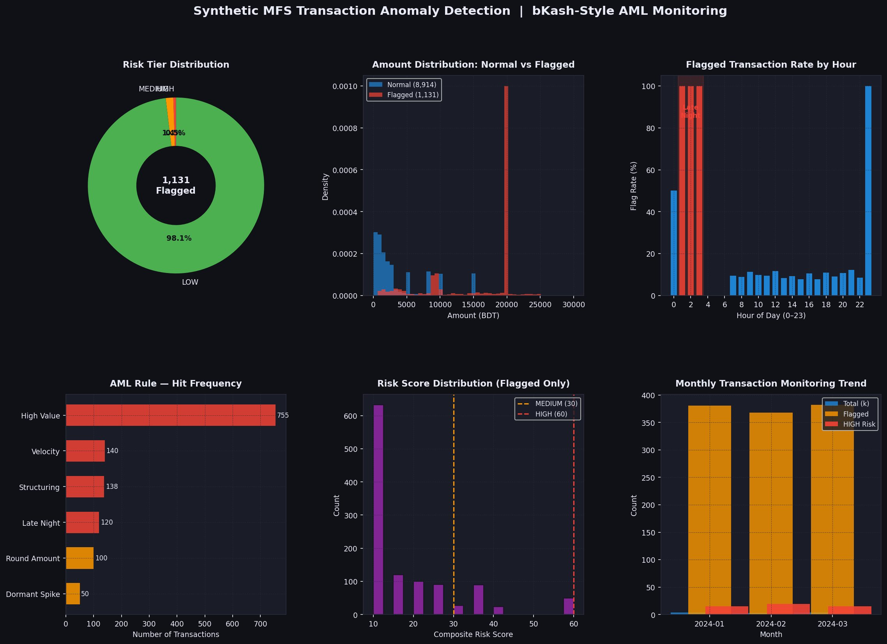

# MFS Transaction Anomaly Detection System
**AML Compliance Solution for Bangladesh Mobile Financial Services**



---

## 🎯 Project Overview

A rule-based transaction monitoring engine (TME) designed specifically for Bangladesh's mobile financial services (MFS) ecosystem, with behavioral patterns calibrated to bKash, Nagad, and Rocket transaction flows.

**Built to address**: The unique compliance challenges of BD MFS operators under BFIU (Bangladesh Financial Intelligence Unit) guidelines, where traditional global AML models fail to account for local transaction behaviors.

---

## 📊 Dashboard Features

The system generates comprehensive compliance dashboards with 6 key visualizations:

1. **Risk Tier Distribution** - Low/Medium/High risk segmentation of flagged transactions
2. **Amount Distribution Analysis** - Normal vs flagged transaction patterns  
3. **Temporal Risk Patterns** - Hour-by-hour flagging rates to identify suspicious timing
4. **Rule Hit Frequency** - Which AML rules trigger most often (High Value, Velocity, Structuring, etc.)
5. **Risk Score Distribution** - Composite scoring with MEDIUM/HIGH thresholds
6. **Monthly Monitoring Trends** - Transaction volume and risk evolution over time

**1,131 transactions flagged** from sample dataset with granular risk scoring and rule attribution.

---

## 🔍 The Problem

Bangladesh MFS platforms process millions of daily transactions with unique characteristics:

- **Round-amount dominance**: BDT 500/1000/5000 transactions are culturally normative, not suspicious
- **cash_out prevalence**: 60-70% of bKash transactions are withdrawals, unlike Western digital wallets
- **Regulatory thresholds**: BFIU guidelines set BDT 100,000 as the key monitoring threshold
- **High false positive rates**: Global AML systems flag normal BD behavior as suspicious

**Result**: Compliance teams waste hours investigating false positives while real anomalies slip through.

---

## ✅ The Solution

A three-component system designed for BD MFS reality:

### 1. **Synthetic Data Generator** (`data_generator.py`)
- Generates realistic MFS transaction datasets
- Transaction mix: 65% cash_out, 20% send_money, 10% payment, 5% cash_in
- Amount distributions matching actual bKash patterns
- Time-of-day clustering (morning/evening peaks)

### 2. **Rule-Based TME** (`rule_based_tme.py`)
- **6 culturally-calibrated AML rules**:
  - **High Value**: Large transactions above BDT 100K threshold
  - **Velocity**: High-frequency patterns (transaction count + recency)
  - **Structuring**: Multiple transactions just below regulatory threshold
  - **Round Amount**: Suspicious round figures (only at ≥BDT 50,000 AND ≥5× user median)
  - **Late Night**: Activity during 3-6 AM window
  - **Dormant Spike**: Sudden activity from inactive accounts

- **Composite risk scoring**: Weighted multi-rule aggregation
- **Explainable output**: Each flag includes risk score and triggering rules

### 3. **Compliance Dashboard** (`dashboard.py`)
- 6-panel visualization system (see screenshot above)
- Exportable flagged transaction reports
- Time-series trend analysis
- Rule performance metrics

---

## 🛠️ Tech Stack

| Component | Technology |
|-----------|------------|
| Data Processing | Python (Pandas, NumPy) |
| Rule Engine | Custom composite scoring algorithm |
| Visualization | Matplotlib, Seaborn |
| Data Storage | CSV (extensible to SQL/NoSQL) |

---

## 📁 Repository Structure

```
synthetic-aml-detection/
│
├── data_generator.py          # MFS transaction simulator
├── rule_based_tme.py          # Core TME with BD-calibrated rules
├── dashboard.py               # Compliance visualization tool
│
├── data/
│   ├── synthetic_transactions.csv    # Generated test data
│   └── flagged_transactions.csv      # TME output
│
├── images/
│   └── aml_dashboard.png             # Dashboard preview
│
└── README.md
```

---

## 🚀 Quick Start

```bash
# Clone repository
git clone https://github.com/monsurhabib01/synthetic-aml-detection.git
cd synthetic-aml-detection

# Install dependencies
pip install pandas numpy matplotlib seaborn

# Generate synthetic data
python data_generator.py

# Run TME
python rule_based_tme.py

# View dashboard
python dashboard.py
```

---

## 🎓 Domain Knowledge Applied

This system reflects deep understanding of:

- **BFIU regulatory framework**: BDT 100K thresholds, CTR/STR requirements
- **BD MFS behavioral norms**: Round amounts, cash_out dominance, peer-to-peer patterns
- **Cultural transaction patterns**: Small-value high-frequency vs. large one-off behaviors
- **Compliance pain points**: False positive reduction, explainable flagging logic

**Key calibration**: The Round Amount rule only triggers at ≥BDT 50,000 AND ≥5× user median, preventing false positives on normative BDT 500/1000/5000 transactions.

---

## 📈 Sample Results

From the dashboard above:
- **1,131 transactions flagged** with risk tier breakdown
- **Risk distribution**: Majority LOW risk (98.1%), with MEDIUM (1.9%) and HIGH (0.1%) tiers
- **Top triggering rules**: High Value (755 hits), Velocity (140), Structuring (138)
- **Temporal patterns**: Peak flagging at hours 2-4 (late night) and 22-23 (evening)

**Business impact**: BD-calibrated rules reduce false positive investigation time while maintaining regulatory compliance coverage.

---

## 🔮 Roadmap

**Phase 2 Enhancements:**
- [ ] Machine learning layer (supervised anomaly detection with labeled data)
- [ ] Real-time API integration capability
- [ ] Multi-account linkage detection (smurfing patterns)
- [ ] Regulatory report auto-generation (CTR/STR formats)
- [ ] Integration with actual MFS transaction APIs

---

## 💼 Use Cases

This system is designed for:

- **MFS Operators**: bKash, Nagad, Rocket compliance teams
- **Banks with MFS**: Compliance officers monitoring agent banking
- **Fintech Startups**: Building AML into new BD payment platforms
- **Regulatory Consultants**: Client risk assessment projects

---

## 📧 Contact

**Monsur Habib**  
AML Data Analyst | Bangladesh  

- 🌐 Portfolio: [aitipseveryday.com](https://aitipseveryday.com)
- 💼 GitHub: [@monsurhabib01](https://github.com/monsurhabib01)
- 📱 WhatsApp: +880 1521 111893

**Available for freelance AML data consultancy projects.**

---

## 📄 License

This project is open-source for educational and portfolio purposes. For commercial use or customization inquiries, please contact directly.

---

**Built with expertise in Bangladesh's AML compliance landscape.**
