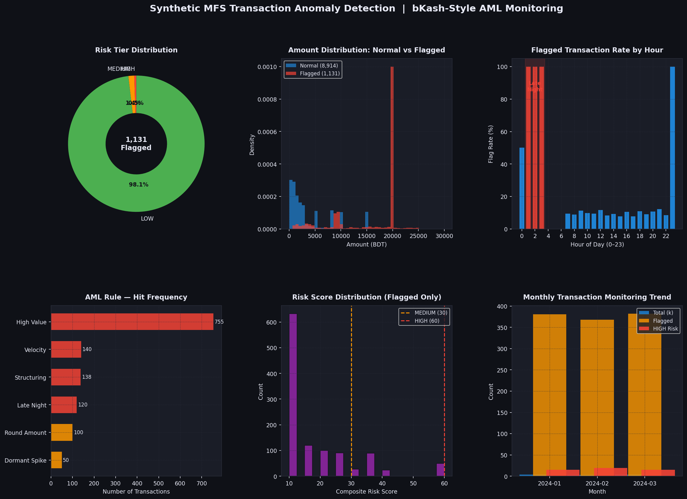

# Synthetic MFS Transaction Anomaly Detection

> **AML-focused transaction monitoring system built on synthetic bKash-style Mobile Financial Service data.**
> Designed to mirror real-world compliance practices in BD Fintech (MFS) environments.

---

## What This Project Does

Generates 10,000+ synthetic MFS transactions with 5 injected AML anomaly types, then applies a **rule-based Transaction Monitoring Engine** (the industry standard approach — not just ML) with composite risk scoring.

### Anomaly Types Detected

| Rule | Signal | Weight |
|------|--------|--------|
| `STRUCTURING` | Multiple txns just below 10,000 BDT reporting threshold (smurfing) | 35 |
| `DORMANT_SPIKE` | Inactive account (30+ days) suddenly transacting high value | 30 |
| `VELOCITY` | >5 transactions within 60 minutes from same account | 25 |
| `LATE_NIGHT` | Transactions between 01:00–04:00 AM | 15 |
| `ROUND_AMOUNT` | Large round-number transfer AND profile outlier (booster only) | 10 |
| `HIGH_VALUE` | Single transaction ≥ 20,000 BDT (booster only) | 10 |

### Risk Tiers
- **HIGH (60–100)** → SAR (Suspicious Activity Report) candidate
- **MEDIUM (30–59)** → Analyst review queue
- **LOW (0–29)** → Monitoring only

---

## Tech Stack

- **Python 3.10+**
- `pandas` — data manipulation and rule engine
- `numpy` — synthetic data generation
- `matplotlib` — visualization dashboard

---

## Project Structure

```
synthetic-aml-detection/
├── generate_data.py        # Synthetic MFS data generator
├── detect_anomalies.py     # Rule-based TMR engine + risk scoring
├── visualize.py            # 6-panel AML monitoring dashboard
├── outputs/
│   └── aml_dashboard.png
└── requirements.txt
```

---

## Quick Start

```bash
pip install -r requirements.txt

python generate_data.py      # Generate synthetic data
python detect_anomalies.py   # Run rule engine
python visualize.py          # Generate dashboard
```

---

## Why Rule-Based (Not ML)?

Real AML compliance systems (NICE Actimize, Oracle FCCM, Temenos) are built on **Transaction Monitoring Rules**, not black-box ML models — because:
1. **Explainability** — regulators require audit trails
2. **Threshold tuning** — rules map directly to regulatory thresholds (e.g., Bangladesh Bank's 10,000 BDT MFS reporting threshold)
3. **Low false-positive tolerance** — ML models without calibration generate too many alerts for compliance teams to handle

This project demonstrates domain understanding, not just modeling technique.

---

## BD Fintech Context

> Round figures like 500, 1000, 5000 BDT are **normal** in bKash — rent, bazar,
> rickshaw, utility bills. `RULE_ROUND_AMOUNT` only fires when amount is both
> ≥ 50,000 BDT **and** ≥ 5× the sender's own median — a genuine profile outlier.
> This eliminates the massive false positive problem that generic AML templates create.

Bangladesh has **~190 million MFS accounts** (bKash: 87M+, Nagad: 82M+).
BFIU (Bangladesh Financial Intelligence Unit) requires MFS operators to monitor and report suspicious transactions.
This project simulates the detection pipeline that feeds into STR/SAR filing workflows.

---

## Output Dashboard



---

*Built as part of an AML Data Analytics portfolio targeting BD Fintech compliance teams.*
